# HOG-Based Industrial Defect Detection and Classification

- **Author:** Adeel Asghar
- **Notebook:** [`NEU_SteelDefect_Lab05_HOG_Inspection.ipynb`](NEU_SteelDefect_Lab05_HOG_Inspection.ipynb) (executed, outputs included)
- **Dataset:** NEU steel surface defect database (NEU-DET), Kaggle repackage [`sovitrath/neu-steel-surface-defect-detect-trainvalid-split`](https://www.kaggle.com/datasets/sovitrath/neu-steel-surface-defect-detect-trainvalid-split)
- **Environment:** Google Colab, CPU pipeline (scikit-image, scikit-learn, OpenCV), run id `37c9b548`

This lab builds a steel-surface inspection prototype from Histogram of Oriented Gradients (HOG) features and classical classifiers. NEU-DET contains only defective images, so the work is split into two tracks. **Track A** names the defect type on whole images (6 classes). **Track B** separates Normal from Defective 64x64 windows, where Normal windows are cut from areas that no annotated defect box touches. With a 16x16-cell, 12-bin HOG vector (2,352 features), an RBF SVM reaches **92.96%** test accuracy on Track A. On Track B the same classifier reaches **78.11%**, so deciding whether a window contains a defect is the weaker link in the pipeline. The final two-stage decision module rejects all 270 defective test images, but it also rejects 24.54% of Normal test windows at its default threshold, and the models degrade sharply under noise, blur and large rotations.

## Results at a Glance

| Item | Result |
|---|---|
| Dataset | 1,800 images, 6 defect types, 300 each, 200x200 pixels (stored as 3-channel files; the channels were identical in the 40 random images checked) |
| Split | 1,260 train / 270 validation / 270 test, stratified, seed 42 (development set = train + validation = 1,530) |
| Track A, best HOG setting | 16x16 cells, 12 bins, 2,352 features (5-fold CV macro-F1 92.23%) |
| Track A, RBF SVM on the test set | accuracy **92.96%**, macro-F1 **92.89%** (251 of 270 images correct) |
| Track A, best other classifier | Random forest: accuracy 89.26%, macro-F1 89.14% |
| Track B, best HOG setting | 16x16 cells, 6 bins, 216 features (5-fold CV macro-F1 77.41%) |
| Track B, RBF SVM on the test set | accuracy **78.11%**, F1 of the Defective class 79.78%, AUC 87.13% (859 test windows) |
| Decision module, threshold 0.5 | 270 of 270 defective test images rejected, defect type correct for 92.96%; 75.46% of Normal test windows accepted; 50.9 ms per image |
| Robustness, Track A SVM (change in macro-F1) | brightness gain x0.75: -0.49, rotation 15 deg: -1.46, noise sigma 10: -39.90, blur sigma 2: -67.13 |

## Contents

1. [Introduction](#1-introduction)
2. [Industrial Application](#2-industrial-application)
3. [Dataset Description](#3-dataset-description)
4. [Image Preprocessing](#4-image-preprocessing)
5. [HOG Feature Extraction](#5-hog-feature-extraction)
6. [Classification Methodology](#6-classification-methodology)
7. [Experimental Setup](#7-experimental-setup)
8. [Results](#8-results)
9. [Robustness Analysis](#9-robustness-analysis)
10. [Industrial Deployment Discussion](#10-industrial-deployment-discussion)
11. [Limitations](#11-limitations)
12. [Conclusion](#12-conclusion)
- [Bonus: Real-Time Inspection Interface](#bonus-real-time-inspection-interface)
- [Appendix A: Lab Task Coverage](#appendix-a-lab-task-coverage)
- [Appendix B: Repository Contents](#appendix-b-repository-contents)
- [Appendix C: How to Reproduce](#appendix-c-how-to-reproduce)
- [Appendix D: References](#appendix-d-references)

---

## 1. Introduction

Visual inspection of manufactured surfaces by people is slow and varies from one inspector to the next. The goal of this lab is a prototype that takes an image of a steel surface and returns an accept or reject decision, using the pipeline required by the brief:

```
Image -> Preprocessing -> HOG feature extraction -> Machine-learning classifier -> Defective / Non-defective decision
```

Two facts about the data shaped the design. First, NEU-DET has six defect types and **no defect-free images**, so the binary formulation in the brief (Class 0 Normal, Class 1 Defective) cannot be built from the images as they are. Second, the images come with XML boxes around the defects, which makes it possible to find parts of an image that no box touches. The lab therefore runs two tracks that share one HOG pipeline:

| Track | What is classified | Classes | Role |
|---|---|---|---|
| **A: defect type** | the whole image, resized to 128x128 | 6 defect types | multi-class (advanced) task, and naming the defect |
| **B: Normal vs Defective** | a 64x64 window cut from an image | Normal (0) / Defective (1) | binary task, and the accept / reject screening decision |

**Main finding.** HOG features with an RBF SVM separate the six defect types well (92.96% test accuracy) but separate Normal from Defective windows only moderately (78.11%), so window screening, not defect naming, limits the two-stage decision module. The remaining sections document how this was measured, how far the result can be trusted, and what happens when the images are degraded.

**What was done**

- Loaded and inspected the dataset, including its annotation quality (Section 3).
- Converted to grayscale, resized, extracted HOG features and visualised them (Sections 4 and 5).
- Studied 9 HOG settings (cell sizes 4, 8, 16 x orientations 6, 9, 12) on both tracks with 5-fold cross-validation (Section 8.1).
- Trained an SVM and four other classifiers on each track, with confusion matrices, classification reports and the requested metrics (Sections 8.2 and 8.3).
- Tested four degradations (brightness, Gaussian noise, rotation, blur) at four severities each (Section 9).
- Built a two-stage quality-control module that prints the required `PRODUCT INSPECTION RESULT` block (Section 10).

## 2. Industrial Application

NEU-DET images come from hot-rolled steel strip. In the sample images (Figures 2 and 5) the six defect types look different from one another: scratches are thin bright lines, inclusions are dark elongated spots, patches are large dark irregular regions, crazing is a network of fine dark cracks over a bright, grainy surface, rolled-in scale shows as small dark specks on a textured background, and pitted surface is a fine speckle whose annotation box covers most of the image.

A rejection decision on a strip has a cost on both sides: a missed defect can reach the customer, and a false rejection scraps or re-inspects good material. The prototype targets the setting where a decision must be made on a CPU within tens of milliseconds and labelled data is limited to a few thousand images. HOG features with an SVM fit that setting. The two deployed models are 10.35 MB (defect type) and 1.89 MB (window screening), and one 200x200 image takes 50.9 ms end to end on the Colab runtime used here (Section 10). This lab does not compare against deep networks, so it makes no claim about which approach is better.

## 3. Dataset Description

### 3.1 Source and layout

The data is the NEU steel surface defect database, repackaged for object detection by the author of the Kaggle dataset with a train / validation split (26.3 MB archive, version 1). The images sit in flat folders and the defect type is **not** given by a class folder; it comes from the file name (of the form `crazing_<number>.jpg`) and is cross-checked against the XML.

| Folder | Files |
|---|---:|
| `train_images` | 1,700 |
| `train_annotations` (XML boxes) | 1,700 |
| `valid_images` | 100 |
| `valid_annotations` (XML boxes) | 100 |

All 1,800 images are 200x200 pixels and are stored as 3-channel RGB files. The largest difference between colour channels over 40 random images was 0, so the content is grayscale.

### 3.2 Classes, boxes and label quality

Each of the six classes has 300 images. Every image has at least one XML box. The table also shows how much of each image the boxes cover (union of boxes, in percent of image area) and how many Normal and Defective windows each class contributes to Track B (Section 3.4).

| Class | Images | Boxes per image | Image area covered by boxes (%) | Normal windows | Defective windows |
| :--- | ---: | ---: | ---: | ---: | ---: |
| `crazing` | 300 | 2.31 | 50.0 | 263 | 557 |
| `inclusion` | 300 | 2.95 | 21.3 | 637 | 542 |
| `patches` | 300 | 2.91 | 36.0 | 413 | 555 |
| `pitted_surface` | 300 | 1.63 | 80.8 | 67 | 436 |
| `rolled-in_scale` | 300 | 2.09 | 29.9 | 545 | 537 |
| `scratches` | 300 | 2.07 | 17.9 | 699 | 490 |
| **All** | 1,800 |  |  | **2,624** | **3,117** |

*Table 1. Per-class dataset summary.*

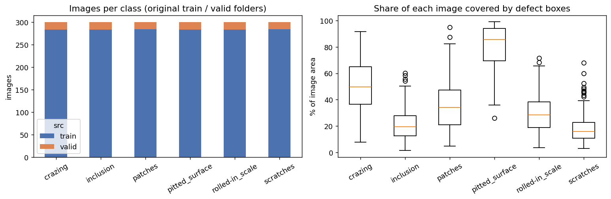

*Figure 1. Images per class (left) and the share of each image covered by defect boxes (right). Pitted surface has the largest box coverage (mean 80.8%), scratches the smallest (17.9%).*

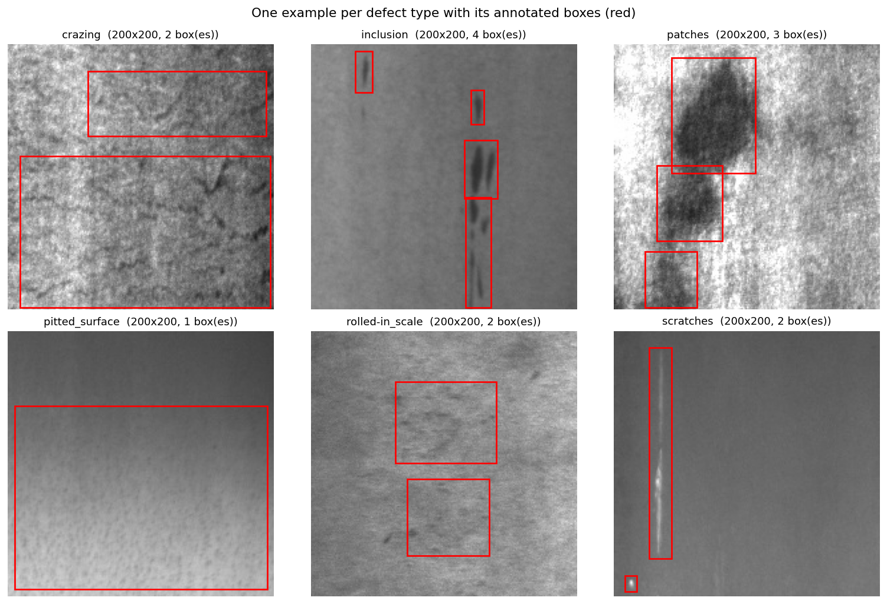

*Figure 2. One example per defect type with its XML boxes (red).*

Two annotation issues matter for the interpretation of the results:

- **Label disagreement.** For 22 of the 1,800 images, the defect type in the file name differs from the most common defect type in the XML.
- **Mixed images.** For 123 images the XML lists more than one defect type, so some images contain two kinds of defect. The file-name class is used as the Track A label. Track B treats every box as a defect, whatever its type.

### 3.3 Split

All 1,800 images were pooled and split again, stratified by class, with seed 42, in the same 70/15/15 way as Labs 1 to 4. The original split (1,700 / 100) was not used because 100 validation images are too few for model selection.

| Split | Images | Per class |
|---|---:|---:|
| Train | 1,260 | 210 |
| Validation | 270 | 45 |
| Test | 270 | 45 |

The **development set** is train + validation (1,530 images). All choices (HOG setting, classifier settings) are made by 5-fold cross-validation on the development set. The test set is used once for the final comparison, then for the robustness study and the decision-module evaluation.

### 3.4 Track B: the window dataset

Because there are no Normal images, Track B builds them from the boxes:

- **Defective window (1):** a 64x64 window centred on an annotated defect box (up to 2 per image, picked at random, at least 16 px apart).
- **Normal window (0):** a 64x64 window that touches **no** defect box after every box is widened by 8 px (up to 3 per image, at least 48 px apart).
- Windows that touch a box without being centred on one are never used.
- Windows are cut from the native-resolution grayscale image. A window belongs to the split of its source image, and Track B cross-validation is grouped by source image, so no image appears on both sides of a fold.

| Split | Normal (0) | Defective (1) | Total |
| :--- | ---: | ---: | ---: |
| train | 1,818 | 2,189 | 4,007 |
| val | 423 | 452 | 875 |
| test | 383 | 476 | 859 |
| **All** | **2,624** | **3,117** | **5,741** |

*Table 2. Windows per split. Together they form 5,741 windows, 2,624 Normal and 3,117 Defective.*

Normal windows exist for only 1,069 of the 1,800 images (59%). They come mostly from scratches (699), inclusion (637) and rolled-in scale (545) images, and hardly at all from pitted surface (67), whose boxes cover 80.8% of the image on average (Table 1).

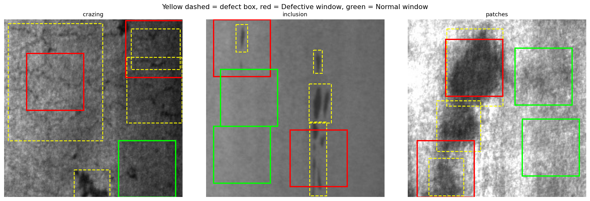

*Figure 3. Window placement. Yellow dashed: annotated boxes. Red: Defective windows centred on a box. Green: Normal windows that touch no widened box.*

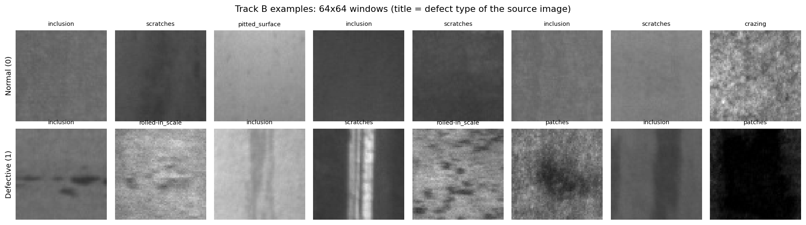

*Figure 4. Random Normal (top) and Defective (bottom) windows. The title is the defect type of the source image. Most Normal windows are smooth background of varying brightness; the Normal window from a crazing image is visibly grainy.*

**What "Normal" means here.** A Normal window is *box-free*, not guaranteed *defect-free*. It is background from a strip that does contain a defect, and the annotation boxes are the only evidence of where the defect is. Section 11 discusses what this does to the Track B numbers.

## 4. Image Preprocessing

1. **Grayscale.** Each image is loaded and converted to a single channel (PIL `convert("L")`). The three channels were identical in all 40 random images checked, so nothing is lost.
2. **Track A: resize.** The 200x200 image is resized to 128x128 with area interpolation (`cv2.INTER_AREA`), which is the appropriate choice when shrinking. The result is an array of shape (1800, 128, 128), `uint8`, pixel range 0 to 255.
3. **Track B: no resizing.** Windows are 64x64 crops of the native grayscale image.
4. **No other processing.** There is no contrast enhancement, filtering or augmentation. Local contrast is handled by the block normalisation inside HOG.

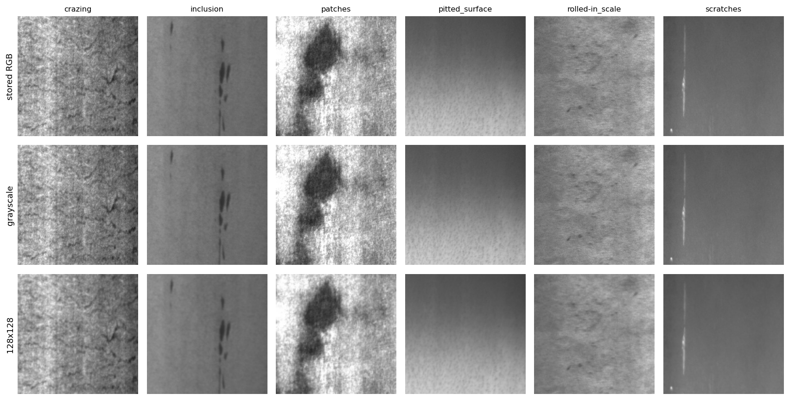

*Figure 5. One image per defect type: stored RGB (top), grayscale (middle), 128x128 (bottom).*

## 5. HOG Feature Extraction

HOG (Dalal and Triggs, 2005) describes an image by the direction of its edges. The implementation is `skimage.feature.hog` with these steps:

1. Compute the gradient at every pixel.
2. Split the image into square **cells** (4, 8 or 16 px) and build, for each cell, a histogram of gradient directions with a chosen number of **orientation bins** (6, 9 or 12).
3. Group cells into overlapping **blocks** of 2x2 cells, moving one cell at a time.
4. Normalise every block with L2-Hys (L2 norm, clip at 0.2, renormalise), which reduces the influence of overall brightness and local contrast.
5. Concatenate all block vectors into one feature vector.

For an image of side N pixels with N divisible by the cell size, the feature length is `(N/cell - 1)^2 x 4 x bins`. The notebook checked this formula against the real feature length for all 9 settings. Smaller cells and more bins give longer vectors that take longer to compute:

| Cell (px) | Bins | Features, 128x128 image | ms per image | Features, 64x64 window | ms per window |
| :--- | ---: | ---: | ---: | ---: | ---: |
| 4 | 6 | 23,064 | 34.52 | 5,400 | 8.08 |
| 4 | 9 | 34,596 | 38.23 | 8,100 | 9.10 |
| 4 | 12 | 46,128 | 35.68 | 10,800 | 5.66 |
| 8 | 6 | 5,400 | 6.08 | 1,176 | 1.43 |
| 8 | 9 | 8,100 | 6.20 | 1,764 | 1.54 |
| 8 | 12 | 10,800 | 6.57 | 2,352 | 1.55 |
| 16 | 6 | 1,176 | 2.61 | 216 | 0.64 |
| 16 | 9 | 1,764 | 3.17 | 324 | 1.00 |
| 16 | 12 | 2,352 | 3.23 | 432 | 0.74 |

*Table 3. HOG feature length and single-thread extraction time per image on the Colab CPU. With 12 bins, 16x16 cells give 19.6 times fewer features than 4x4 cells (2,352 against 46,128) and extract 11 times faster per image (3.23 ms against 35.68 ms).*

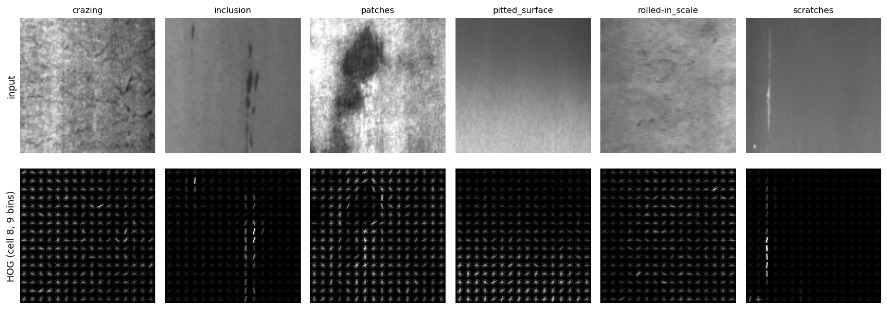

*Figure 6. Input (top) and HOG picture (bottom, 8x8 cells, 9 bins) for one image per defect type. Bright strokes mark strong gradients in that direction.*

In Figure 6, scratches and inclusions produce a few strong, mostly vertical strokes at the defect. Crazing, patches and rolled-in scale spread weaker gradients of many directions over the whole image, which is texture rather than a single edge. Pitted surface gives low, diffuse energy.

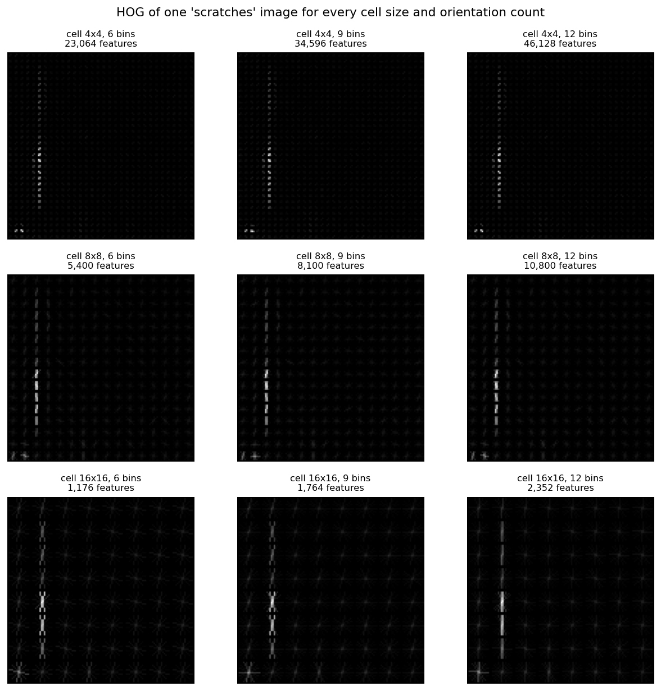

*Figure 7. HOG of one scratches image for every cell size (rows) and number of bins (columns). The vertical scratch stays visible at every setting; cells of 4x4 pixels split it into many tiny strokes, and cells of 16x16 pixels merge it into a few long ones.*

## 6. Classification Methodology

### 6.1 Classifiers

Five classifiers are trained on each track on top of the same HOG vector:

| Classifier | Implementation | Settings chosen by cross-validation |
|---|---|---|
| SVM (RBF) | `SVC(kernel="rbf", probability=True)`; Track B with `class_weight="balanced"` | C in {1, 10, 100, 1000} (Track B: {1, 10, 100}); gamma = m x `"scale"`, m in {0.25, 0.5, 1, 2, 4} (Track B: {0.5, 1, 2}) |
| SVM (linear) | `LinearSVC` | C in {0.1, 1, 10} |
| Random forest | 300 trees (Track B: `balanced_subsample` class weights) | none (fixed) |
| k-NN | distance-weighted | k in {1, 3, 5, 7, 9} |
| Logistic regression | lbfgs, `max_iter=300` | C in {1, 10, 100}, first CV fold only (it is the slowest to fit) |

The RBF SVM is the main classifier. `probability=True` makes scikit-learn fit a calibration (Platt scaling) so the decision module can report a confidence.

### 6.2 Selection protocol

1. **HOG setting.** Every combination of cell size and bins is scored with the same SVM (RBF, C=10, gamma `"scale"`) by 5-fold cross-validation on the development set. Track A uses stratified folds; Track B uses stratified folds grouped by source image. To keep the 9-setting sweep fast, the SVM runs through a precomputed RBF kernel matrix, which is mathematically the same as `SVC(kernel="rbf")`.
2. **Parsimony rule.** Among all settings whose mean macro-F1 is within 0.5 points of the best, the one with the shortest feature vector is kept.
3. **Classifier settings.** Tuned by cross-validation on the kept HOG setting (Table 6).
4. **Final fit and test.** Each classifier is refit on the whole development set and scored **once** on the test set.

### 6.3 Metrics

Accuracy, macro-averaged precision, recall and F1, and balanced accuracy for both tracks. Track B adds precision, recall and F1 of the Defective class, the **false-reject rate** (Normal windows flagged as Defective), the **missed-defect rate** (Defective windows passed as Normal) and ROC AUC.

### 6.4 The decision module

`inspect_product(image)` works in two stages:

1. **Screening (Track B).** A 64x64 window is slid over the image (positions 0, 34, 68, 102, 136 on each axis, so 25 windows for a 200x200 image). The Track B RBF SVM gives P(defect) for each window. If the most suspicious window has P(defect) >= 0.5, the product is **REJECTED**; otherwise it is **ACCEPTED**. A 64x64 input is treated as a single window.
2. **Defect type (Track A).** For a rejected product, the Track A RBF SVM looks at the whole image (resized to 128x128) and names the defect type.

The reported confidence is the calibrated probability of the decision: the top window's P(defect) for a rejection, and 1 minus it for an acceptance.

## 7. Experimental Setup

| Setting | Value |
|---|---|
| Platform | Google Colab (T4 runtime type; the pipeline uses the CPU only) |
| Random seed | 42 (split, folds, noise, models) |
| Libraries | scikit-image `hog`, scikit-learn, OpenCV; exact versions are stored in `models/inspection_config.json` |
| Image size, Track A | 128x128 grayscale |
| Window size, Track B | 64x64, native resolution |
| HOG block / normalisation | 2x2 cells, L2-Hys |
| HOG study | cell size {4, 8, 16} x orientation bins {6, 9, 12} |
| Cross-validation | 5 folds on the development set (1,530 images; 4,882 windows) |
| Test set | 270 images (45 per class); 859 windows (383 Normal, 476 Defective) |
| Decision threshold | P(defect) >= 0.5 on the top of 25 windows |
| Robustness | 4 conditions x 4 severities, see Section 9 |

Each HOG sweep took under 3 minutes (163 s for Track A, 169 s for Track B). The notebook saves every finished step (sweep rows, tuning rows, test results, fitted models and figures) to Google Drive, so a disconnected Colab session resumes from the last finished step.

## 8. Results

### 8.1 HOG parameter study (cell size x orientations)

Scores are 5-fold cross-validation on the development set, with the same SVM (RBF, C=10, gamma `"scale"`) in every row. The "std" columns are the standard deviation over the 5 folds. Best values are in bold.

**Track A: six defect types**

| Cell (px) | Bins | Features | Accuracy (%) | Acc. std | Macro-F1 (%) | F1 std |
| :--- | ---: | ---: | ---: | ---: | ---: | ---: |
| 4 | 6 | 23,064 | 82.55 | 1.84 | 82.14 | 1.93 |
| 4 | 9 | 34,596 | 81.18 | 2.36 | 80.67 | 2.53 |
| 4 | 12 | 46,128 | 83.79 | 1.66 | 83.42 | 1.77 |
| 8 | 6 | 5,400 | 88.76 | 1.14 | 88.62 | 1.16 |
| 8 | 9 | 8,100 | 88.04 | 1.38 | 87.88 | 1.46 |
| 8 | 12 | 10,800 | 89.15 | 1.50 | 89.05 | 1.51 |
| 16 | 6 | 1,176 | 90.85 | 0.92 | 90.74 | 0.94 |
| 16 | 9 | 1,764 | 90.92 | 0.52 | 90.81 | 0.55 |
| 16 | 12 | 2,352 | **92.29** | 0.73 | **92.23** | 0.77 |

*Table 4. Track A: cross-validated scores for the 9 HOG settings.*

**Track B: Normal vs Defective windows**

| Cell (px) | Bins | Features | Accuracy (%) | Acc. std | Macro-F1 (%) | F1 std | F1 of Defective (%) |
| :--- | ---: | ---: | ---: | ---: | ---: | ---: | ---: |
| 4 | 6 | 5,400 | 75.84 | 0.89 | 75.61 | 0.87 | 77.93 |
| 4 | 9 | 8,100 | 74.53 | 0.74 | 74.29 | 0.66 | 76.75 |
| 4 | 12 | 10,800 | 73.69 | 0.64 | 73.34 | 0.64 | 76.37 |
| 8 | 6 | 1,176 | 76.51 | 0.81 | 76.36 | 0.82 | 78.16 |
| 8 | 9 | 1,764 | 76.81 | 1.09 | 76.60 | 1.10 | 78.73 |
| 8 | 12 | 2,352 | 76.54 | 1.32 | 76.35 | 1.30 | 78.44 |
| 16 | 6 | 216 | 77.50 | 1.50 | 77.41 | 1.49 | 78.62 |
| 16 | 9 | 324 | 77.60 | 1.32 | 77.45 | 1.30 | 79.11 |
| 16 | 12 | 432 | **78.01** | 0.78 | **77.84** | 0.74 | **79.65** |

*Table 5. Track B: cross-validated scores for the 9 HOG settings.*

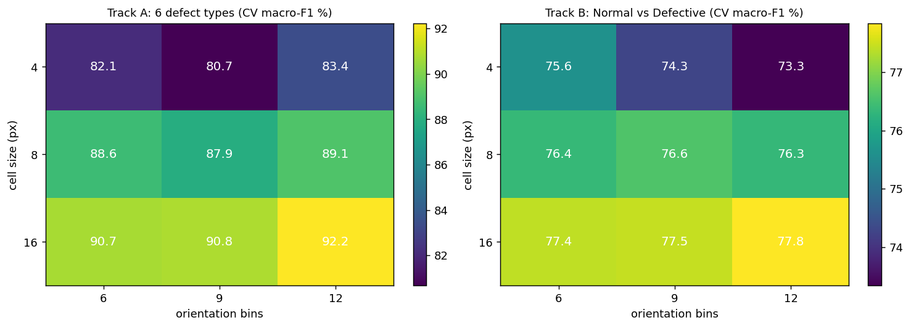

*Figure 8. Cross-validated macro-F1 for every cell size and number of bins, Track A (left) and Track B (right).*

**Cell size has the larger effect.** On Track A the mean macro-F1 rises from 82.08% (4x4 cells) to 88.52% (8x8) to 91.26% (16x16), steps of 6.4 and 2.7 points, while the fold-to-fold standard deviation is 0.5 to 2.5 points. The number of bins matters less: within one cell size, the spread across 6, 9 and 12 bins is 2.75, 1.17 and 1.49 points for 4x4, 8x8 and 16x16 cells. Twelve bins scored highest at every cell size, but 9 bins scored below 6 bins at both 4x4 and 8x8 cells, so more bins did not help steadily. Track B follows the same order of cell sizes (mean macro-F1 74.41%, 76.44%, 77.57%) in a narrower range, 73.34% to 77.84%.

**Why larger cells help was not tested.** One plausible reason is that 16x16 cells summarise gradients over a larger area, which gives far fewer features for the same 1,530 training images and a vector that is less sensitive to pixel-level texture. This explanation was not checked with an ablation.

**Selected settings.** The parsimony rule kept 16x16 cells with 12 bins for Track A (also the highest-scoring setting, 2,352 features) and 16x16 cells with **6 bins** for Track B (216 features). For Track B, 12 bins scored 0.43 points higher (77.84% against 77.41%), which is smaller than the fold standard deviation of either setting (0.74 and 1.49).

### 8.2 Track A: six defect types

**Settings chosen for the classifiers** (cross-validation on the development set, kept HOG setting of each track):

| Track | Classifier | Chosen setting | CV macro-F1 (%) |
| :--- | :--- | :--- | ---: |
| A (6 types) | SVM (RBF) | C=10, gamma=0.1124 (1.0 x "scale") | 92.23 |
| A (6 types) | SVM (linear) | C=0.1 | 79.44 |
| A (6 types) | k-NN | k=1 | 77.10 |
| A (6 types) | Logistic regression | C=100 | 86.66 |
| B (Normal/Defective) | SVM (RBF) | C=10, gamma=1.3962 (1.0 x "scale") | 77.41 |
| B (Normal/Defective) | SVM (linear) | C=10 | 73.10 |
| B (Normal/Defective) | k-NN | k=3 | 69.33 |
| B (Normal/Defective) | Logistic regression | C=1 | 70.46 |

*Table 6. Chosen settings. For the RBF SVM on Track A, C=10, 100 and 1000 gave identical scores at gamma x1.0. Five of the eight tuned settings sit at the edge of their grid (Track A: linear SVM C=0.1, k-NN k=1, logistic regression C=100; Track B: linear SVM C=10, logistic regression C=1), so the grid may have limited those classifiers.*

**Test-set comparison** (270 images, metrics in %):

| Classifier | Accuracy (%) | Precision, macro (%) | Recall, macro (%) | F1, macro (%) | Balanced acc. (%) | Fit (s) | Predict (ms/sample) |
| :--- | ---: | ---: | ---: | ---: | ---: | ---: | ---: |
| SVM (RBF) | **92.96** | **92.99** | **92.96** | **92.89** | **92.96** | 8.1 | 2.65 |
| SVM (linear) | 77.41 | 77.25 | 77.41 | 76.59 | 77.41 | 3.3 | 0.01 |
| Random forest | 89.26 | 89.27 | 89.26 | 89.14 | 89.26 | 17.0 | 0.32 |
| k-NN | 82.59 | 87.18 | 82.59 | 79.97 | 82.59 | 0.0 | 0.21 |
| Logistic regression | 81.11 | 81.14 | 81.11 | 80.90 | 81.11 | 2.3 | 0.02 |

*Table 7. Track A, all five classifiers, scored once on the test set. Best in bold.*

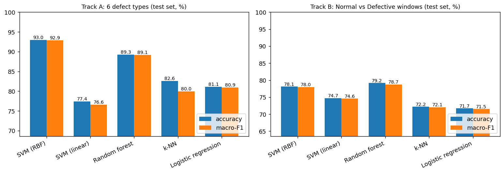

*Figure 9. Accuracy and macro-F1 on the test set for both tracks. The vertical axes start above zero (about 69 for Track A, about 64 for Track B), which exaggerates the differences visually.*

The RBF SVM is the best classifier on Track A (92.96%, 251 of 270 images). The random forest is second (89.26%), 3.70 points lower. The linear SVM is 15.55 points below the RBF SVM, but its best C was the smallest value in the grid, so a smaller C might narrow the gap; this was not tried.

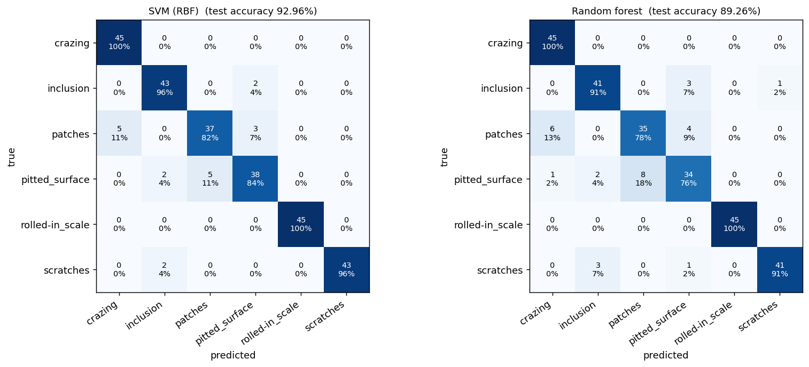

*Figure 10. Confusion matrices on the test set for the RBF SVM (left) and the random forest (right). Each cell shows the count and the share of the true class.*

**Classification report, RBF SVM**

```
Classification report: SVM (RBF) (Track A, test set)
                 precision    recall  f1-score   support

        crazing      0.900     1.000     0.947        45
      inclusion      0.915     0.956     0.935        45
        patches      0.881     0.822     0.851        45
 pitted_surface      0.884     0.844     0.864        45
rolled-in_scale      1.000     1.000     1.000        45
      scratches      1.000     0.956     0.977        45

       accuracy                          0.930       270
      macro avg      0.930     0.930     0.929       270
   weighted avg      0.930     0.930     0.929       270
```

<details>
<summary>Classification report, random forest</summary>

```
Classification report: Random forest (Track A, test set)
                 precision    recall  f1-score   support

        crazing      0.865     1.000     0.928        45
      inclusion      0.891     0.911     0.901        45
        patches      0.814     0.778     0.795        45
 pitted_surface      0.810     0.756     0.782        45
rolled-in_scale      1.000     1.000     1.000        45
      scratches      0.976     0.911     0.943        45

       accuracy                          0.893       270
      macro avg      0.893     0.893     0.891       270
   weighted avg      0.893     0.893     0.891       270
```

</details>

Rolled-in scale is classified perfectly (45 of 45), and crazing has perfect recall (45 of 45) but precision 0.900 because 5 patches images are called crazing. The weakest classes are patches (F1 0.851) and pitted surface (F1 0.864). Of the 19 errors of the RBF SVM, 8 are patches / pitted-surface confusions (3 patches called pitted surface, 5 pitted surface called patches), 5 are patches called crazing, and the other 6 are inclusion / pitted-surface (2 each way) and scratches called inclusion (2).

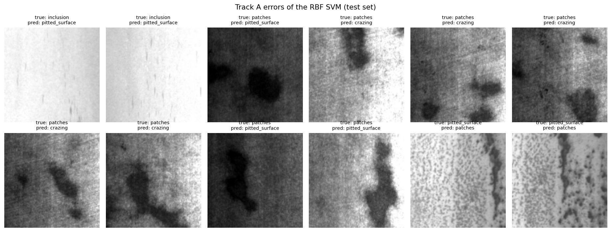

*Figure 11. The first 12 test images the RBF SVM got wrong (in test-set order).*

Among these 12 errors, 8 are patches images, mostly with large dark blobs on a textured background; 2 are bright, washed-out inclusion images with faint thin streaks (called pitted surface); and 2 are pitted-surface images with a dark band next to the speckle (called patches). Because 123 of the 1,800 XML files list more than one defect type, part of the patches / pitted-surface confusion may come from images that really contain both. This was not checked image by image.

### 8.3 Track B: Normal vs Defective windows

**Test-set comparison** (859 windows: 383 Normal, 476 Defective; metrics in %):

| Classifier | Accuracy (%) | Balanced acc. (%) | Precision, Defective (%) | Recall, Defective (%) | F1, Defective (%) | F1, macro (%) | Missed defect (%) | False reject (%) | AUC (%) | Fit (s) | Predict (ms/sample) |
| :--- | ---: | ---: | ---: | ---: | ---: | ---: | ---: | ---: | ---: | ---: | ---: |
| SVM (RBF) | 78.11 | 78.14 | 81.72 | 77.94 | 79.78 | 77.96 | 22.06 | 21.67 | 87.13 | 14.0 | 0.78 |
| SVM (linear) | 74.74 | 74.78 | 78.84 | 74.37 | 76.54 | 74.59 | 25.63 | 24.80 | 83.89 | 5.9 | 0.00 |
| Random forest | **79.16** | **78.57** | 79.52 | **84.03** | **81.72** | **78.75** | **15.97** | 26.89 | **89.42** | 22.9 | 0.10 |
| k-NN | 72.18 | 73.72 | **86.02** | 59.45 | 70.31 | 72.07 | 40.55 | **12.01** | 80.87 | 0.0 | 0.07 |
| Logistic regression | 71.71 | 71.67 | 75.72 | 72.06 | 73.84 | 71.52 | 27.94 | 28.72 | 80.86 | 0.1 | 0.00 |

*Table 8. Track B, all five classifiers, scored once on the test set. Best in bold (for "missed defect" and "false reject", lowest is best). These rows use each classifier's own decision rule; for the SVM that is the sign of its score.*

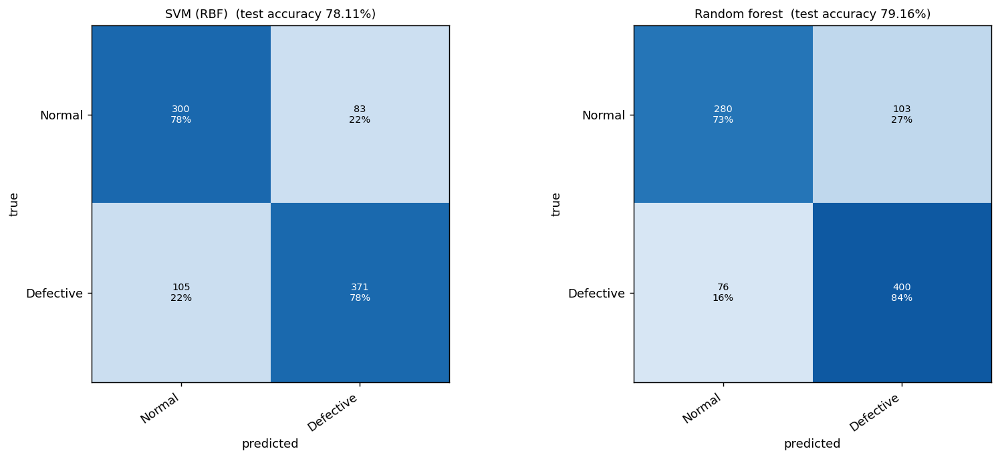

*Figure 12. Confusion matrices on the test windows. RBF SVM: 300 Normal and 371 Defective windows correct, 83 false rejects, 105 missed defects. Random forest: 280 and 400 correct, 103 false rejects, 76 missed defects.*

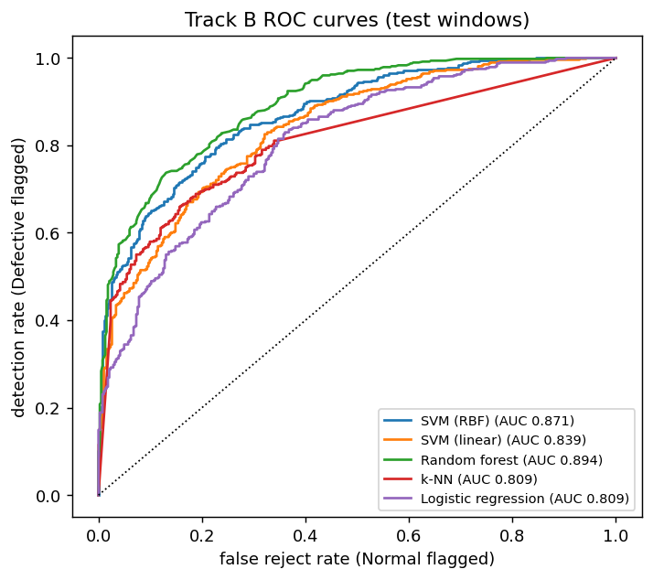

*Figure 13. ROC curves on the test windows. AUC: random forest 0.894, RBF SVM 0.871, linear SVM 0.839, k-NN 0.809, logistic regression 0.809.*

The random forest (79.16%) and the RBF SVM (78.11%) are 1.05 points apart on 859 windows. Sampling error alone is about +/-2.8 points at this size (normal approximation; windows from the same image are correlated, so the true uncertainty is larger), so the two cannot be told apart here. The RBF SVM was kept for the decision module because it was chosen as the main classifier before the test comparison and because it supplies the calibrated probabilities the module reports. The random forest finds more defective windows (recall 84.03% against 77.94%) but rejects more Normal windows (false reject 26.89% against 21.67%).

**Classification report, RBF SVM**

```
Classification report: SVM (RBF) (Track B, test set)
              precision    recall  f1-score   support

      Normal      0.741     0.783     0.761       383
   Defective      0.817     0.779     0.798       476

    accuracy                          0.781       859
   macro avg      0.779     0.781     0.780       859
weighted avg      0.783     0.781     0.782       859
```

<details>
<summary>Classification report, random forest</summary>

```
Classification report: Random forest (Track B, test set)
              precision    recall  f1-score   support

      Normal      0.787     0.731     0.758       383
   Defective      0.795     0.840     0.817       476

    accuracy                          0.792       859
   macro avg      0.791     0.786     0.787       859
weighted avg      0.791     0.792     0.791       859
```

</details>

**Reject threshold.** The decision module does not use the SVM's own sign rule. It rejects when the calibrated P(defect) is at or above a threshold. The table shows what the threshold does on the test windows:

| Threshold on P(defect) | Detection rate (%) | Missed defect (%) | False reject (%) | Precision (%) |
| :--- | ---: | ---: | ---: | ---: |
| 0.1 | 99.37 | 0.63 | 75.72 | 61.99 |
| 0.3 | 91.60 | 8.40 | 47.52 | 70.55 |
| 0.5 | 80.67 | 19.33 | 24.54 | 80.33 |
| 0.7 | 65.34 | 34.66 | 10.70 | 88.35 |
| 0.9 | 39.92 | 60.08 | 1.31 | 97.44 |

*Table 9. Effect of the reject threshold on the 859 test windows (RBF SVM probabilities).*

At the default 0.5 the module detects 80.67% of Defective windows (384 of 476) and rejects 24.54% of Normal windows (94 of 383), slightly more defect-prone than the sign rule in Table 8 (recall 77.94%). The probabilities are calibrated on development windows, 54.1% of which are Defective, which likely explains the small shift. Raising the threshold to 0.9 cuts false rejects to 1.31% but detects only 39.92% of Defective windows.

## 9. Robustness Analysis

The trained models are **not retrained**. They are tested on the test set after the images are degraded the way a line camera might degrade them. Each condition is applied to the grayscale image at native resolution, before resizing and HOG (for Track B, to the 64x64 window itself).

| Condition | Severities | Implementation |
|---|---|---|
| Brightness | gain x0.5, x0.75, x1.25, x1.5 | pixel values multiplied, clipped to 0 to 255 |
| Gaussian noise | sigma 5, 10, 20, 40 grey levels | added noise, clipped to 0 to 255 |
| Rotation | 5, 15, 45, 90 degrees | about the centre, mirrored borders |
| Blur | sigma 1, 2, 3, 5 pixels | Gaussian blur |

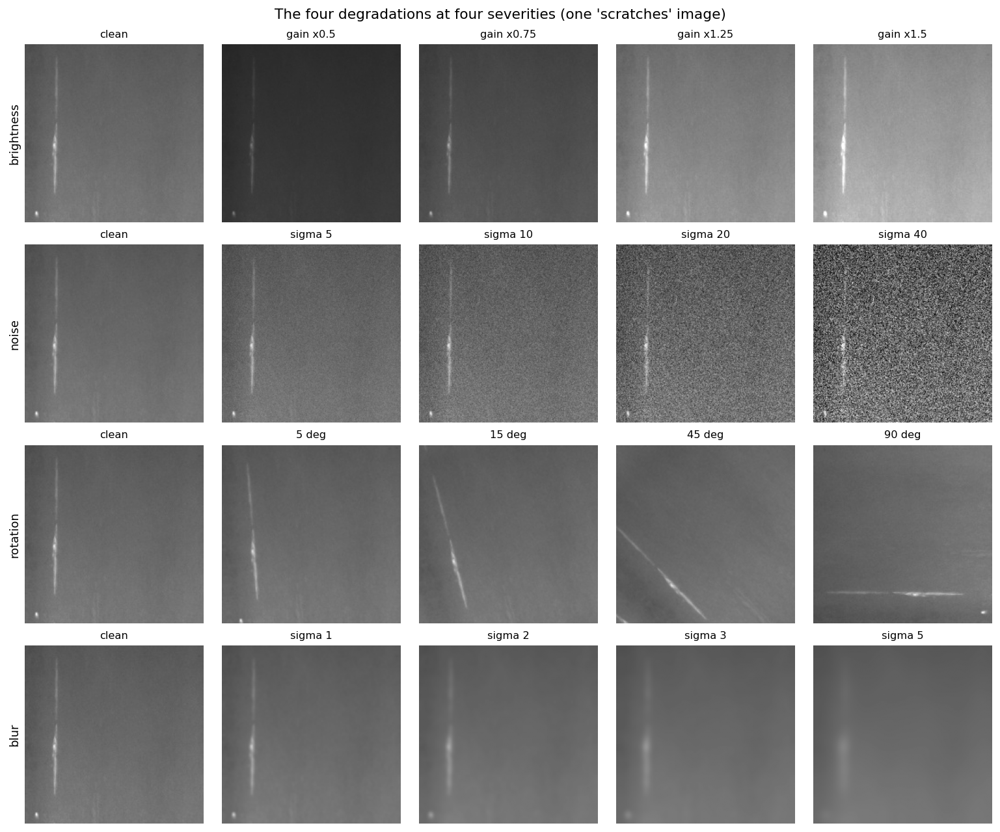

*Figure 14. One scratches image under each degradation and severity.*

**Track A, RBF SVM** (change = degraded minus clean, in points)

| Condition | Level | Accuracy (%) | Change in accuracy | F1, macro (%) | Change in F1 |
| :--- | :--- | ---: | ---: | ---: | ---: |
| clean | none | 92.96 | 0.00 | 92.89 | 0.00 |
| brightness | gain x0.5 | 84.81 | -8.15 | 84.63 | -8.26 |
| brightness | gain x0.75 | 92.59 | -0.37 | 92.40 | -0.49 |
| brightness | gain x1.25 | 84.81 | -8.15 | 84.81 | -8.08 |
| brightness | gain x1.5 | 68.15 | -24.81 | 67.71 | -25.18 |
| noise | sigma 5 | 80.00 | -12.96 | 79.59 | -13.31 |
| noise | sigma 10 | 57.78 | -35.19 | 53.00 | -39.90 |
| noise | sigma 20 | 30.00 | -62.96 | 21.88 | -71.02 |
| noise | sigma 40 | 17.78 | -75.19 | 6.68 | -86.22 |
| rotation | 5 deg | 93.70 | 0.74 | 93.68 | 0.78 |
| rotation | 15 deg | 91.48 | -1.48 | 91.43 | -1.46 |
| rotation | 45 deg | 60.00 | -32.96 | 50.01 | -42.88 |
| rotation | 90 deg | 39.26 | -53.70 | 37.23 | -55.66 |
| blur | sigma 1 | 84.81 | -8.15 | 84.67 | -8.22 |
| blur | sigma 2 | 31.11 | -61.85 | 25.76 | -67.13 |
| blur | sigma 3 | 16.67 | -76.30 | 5.54 | -87.36 |
| blur | sigma 5 | 16.67 | -76.30 | 4.76 | -88.13 |

*Table 10. Track A, RBF SVM under degradation. Change = degraded minus clean.*

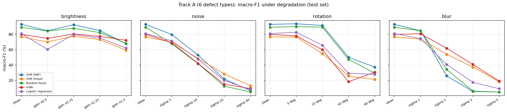

*Figure 15. Track A macro-F1 of all five classifiers under each degradation (test set).*

**Track B, RBF SVM**

| Condition | Level | Accuracy (%) | Change in accuracy | F1, Defective (%) | Change in F1 |
| :--- | :--- | ---: | ---: | ---: | ---: |
| clean | none | 78.11 | 0.00 | 79.78 | 0.00 |
| brightness | gain x0.5 | 73.57 | -4.54 | 73.76 | -6.03 |
| brightness | gain x0.75 | 77.65 | -0.47 | 77.93 | -1.85 |
| brightness | gain x1.25 | 76.25 | -1.86 | 78.16 | -1.63 |
| brightness | gain x1.5 | 75.90 | -2.21 | 78.46 | -1.33 |
| noise | sigma 5 | 70.90 | -7.22 | 68.27 | -11.51 |
| noise | sigma 10 | 60.65 | -17.46 | 50.44 | -29.35 |
| noise | sigma 20 | 52.04 | -26.08 | 33.33 | -46.45 |
| noise | sigma 40 | 46.10 | -32.01 | 20.31 | -59.48 |
| rotation | 5 deg | 77.07 | -1.05 | 80.08 | 0.30 |
| rotation | 15 deg | 76.60 | -1.51 | 79.17 | -0.61 |
| rotation | 45 deg | 69.38 | -8.73 | 74.19 | -5.59 |
| rotation | 90 deg | 71.59 | -6.52 | 72.52 | -7.26 |
| blur | sigma 1 | 65.08 | -13.04 | 74.49 | -5.30 |
| blur | sigma 2 | 56.11 | -22.00 | 71.24 | -8.54 |
| blur | sigma 3 | 55.53 | -22.58 | 71.36 | -8.42 |
| blur | sigma 5 | 55.41 | -22.70 | 71.31 | -8.47 |

*Table 11. Track B, RBF SVM under degradation. The F1 is that of the Defective class.*

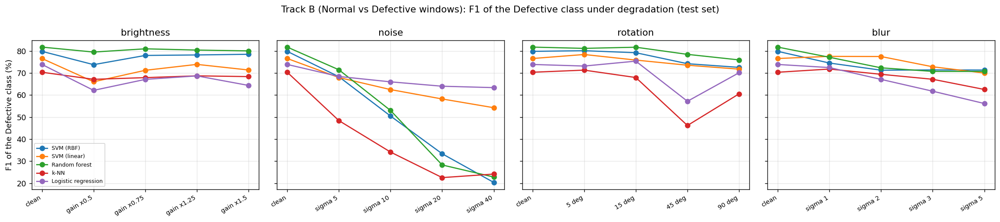

*Figure 16. Track B F1 of the Defective class for all five classifiers under each degradation (test windows).*

<details>
<summary>Random forest, Track A</summary>

| Condition | Level | Accuracy (%) | Change in accuracy | F1, macro (%) | Change in F1 |
| :--- | :--- | ---: | ---: | ---: | ---: |
| clean | none | 89.26 | 0.00 | 89.14 | 0.00 |
| brightness | gain x0.5 | 84.44 | -4.81 | 84.17 | -4.97 |
| brightness | gain x0.75 | 88.15 | -1.11 | 87.80 | -1.35 |
| brightness | gain x1.25 | 82.59 | -6.67 | 82.16 | -6.98 |
| brightness | gain x1.5 | 68.89 | -20.37 | 68.20 | -20.95 |
| noise | sigma 5 | 69.26 | -20.00 | 67.53 | -21.61 |
| noise | sigma 10 | 48.15 | -41.11 | 41.70 | -47.44 |
| noise | sigma 20 | 22.59 | -66.67 | 12.39 | -76.75 |
| noise | sigma 40 | 16.67 | -72.59 | 4.93 | -84.21 |
| rotation | 5 deg | 90.00 | 0.74 | 89.92 | 0.78 |
| rotation | 15 deg | 89.26 | 0.00 | 89.25 | 0.11 |
| rotation | 45 deg | 53.70 | -35.56 | 47.35 | -41.79 |
| rotation | 90 deg | 33.70 | -55.56 | 29.34 | -59.81 |
| blur | sigma 1 | 84.81 | -4.44 | 84.63 | -4.51 |
| blur | sigma 2 | 38.15 | -51.11 | 34.24 | -54.91 |
| blur | sigma 3 | 16.67 | -72.59 | 6.02 | -83.12 |
| blur | sigma 5 | 16.67 | -72.59 | 4.76 | -84.38 |

</details>

<details>
<summary>Random forest, Track B</summary>

| Condition | Level | Accuracy (%) | Change in accuracy | F1, Defective (%) | Change in F1 |
| :--- | :--- | ---: | ---: | ---: | ---: |
| clean | none | 79.16 | 0.00 | 81.72 | 0.00 |
| brightness | gain x0.5 | 78.46 | -0.70 | 79.47 | -2.25 |
| brightness | gain x0.75 | 79.28 | 0.12 | 80.94 | -0.77 |
| brightness | gain x1.25 | 77.65 | -1.51 | 80.37 | -1.35 |
| brightness | gain x1.5 | 77.07 | -2.10 | 80.00 | -1.72 |
| noise | sigma 5 | 72.53 | -6.64 | 71.43 | -10.29 |
| noise | sigma 10 | 62.17 | -17.00 | 52.97 | -28.75 |
| noise | sigma 20 | 48.54 | -30.62 | 28.25 | -53.47 |
| noise | sigma 40 | 44.70 | -34.46 | 22.76 | -58.95 |
| rotation | 5 deg | 76.95 | -2.21 | 81.14 | -0.57 |
| rotation | 15 deg | 78.00 | -1.16 | 81.67 | -0.05 |
| rotation | 45 deg | 73.22 | -5.94 | 78.42 | -3.29 |
| rotation | 90 deg | 73.69 | -5.47 | 75.91 | -5.81 |
| blur | sigma 1 | 68.34 | -10.83 | 77.10 | -4.61 |
| blur | sigma 2 | 58.91 | -20.26 | 72.31 | -9.40 |
| blur | sigma 3 | 55.41 | -23.75 | 70.70 | -11.02 |
| blur | sigma 5 | 54.83 | -24.33 | 70.69 | -11.02 |

</details>

**Findings**

- **Brightness.** On Track A, gain x0.75 costs only 0.37 points of accuracy, but gain x0.5 and x1.25 cost 8.15 points each and x1.5 costs 24.81. Bright, over-exposed images hurt most; clipping at 255 may be the cause, which was not isolated. On Track B the largest accuracy loss is 4.54 points (gain x0.5).
- **Gaussian noise** hurts even at low levels. Track A accuracy falls by 12.96 points at sigma 5 and 35.19 at sigma 10, and reaches 17.78% at sigma 40, close to the 16.67% expected from guessing among six balanced classes. Track B accuracy drops from 78.11% to 70.90% at sigma 5 and 46.10% at sigma 40, and the F1 of the Defective class from 79.78% to 20.31%.
- **Rotation.** Up to 15 degrees costs at most 1.48 points on Track A (5 degrees even gains 0.74). At 45 degrees accuracy falls by 32.96 points and at 90 degrees by 53.70. HOG is not rotation invariant: a rotated defect puts its gradients into different orientation bins. Track B is less affected (accuracy -8.73 at 45 degrees, -6.52 at 90).
- **Blur.** Track A loses 8.15 points at sigma 1 and 61.85 at sigma 2. At sigma 3 and 5 accuracy is exactly 16.67% (45 of 270), which is what predicting one class for every image gives. Figure 14 shows why: at sigma 3 the scratch is a faint smudge.
- **Direction of the Track B failures.** Under blur, Track B accuracy settles at 55.41% for sigma 5, which equals the share of Defective test windows (476 of 859): the model labels almost every window Defective, so blur pushes the screening stage towards REJECT. Under heavy noise (sigma 40) the accuracy of 46.10% is close to the 44.59% obtained by labelling every window Normal, and the F1 of the Defective class is 20.31%, which indicates that most defective windows pass as Normal. These two readings are inferred from the accuracy and F1 values; the confusion matrices under degradation were not printed.
- **No classifier is robust.** The random forest is somewhat better than the RBF SVM on dim Track A images (-4.81 against -8.15 points at gain x0.5) and at blur sigma 2 (-51.11 against -61.85), but worse at noise sigma 10 (-41.11 against -35.19). In Figure 16 the linear SVM and logistic regression lose F1 more slowly under noise than the RBF SVM, random forest and k-NN.

## 10. Industrial Deployment Discussion

### 10.1 The decision module in action

These are the notebook's own outputs for three defective test images (crazing, inclusion, patches) and three Normal 64x64 test windows:

```
[true defect type: crazing]
PRODUCT INSPECTION RESULT
Prediction: DEFECTIVE
Confidence: 93.8%
Action: REJECT PRODUCT
  details: defect type = crazing (89.7% confidence), most suspicious window at x=102, y=34

[true defect type: inclusion]
PRODUCT INSPECTION RESULT
Prediction: DEFECTIVE
Confidence: 92.0%
Action: REJECT PRODUCT
  details: defect type = inclusion (95.0% confidence), most suspicious window at x=136, y=102

[true defect type: patches]
PRODUCT INSPECTION RESULT
Prediction: DEFECTIVE
Confidence: 99.4%
Action: REJECT PRODUCT
  details: defect type = patches (98.4% confidence), most suspicious window at x=34, y=34

[a Normal 64x64 window from the test set]
PRODUCT INSPECTION RESULT
Prediction: NON-DEFECTIVE
Confidence: 56.9%
Action: ACCEPT PRODUCT

[a Normal 64x64 window from the test set]
PRODUCT INSPECTION RESULT
Prediction: NON-DEFECTIVE
Confidence: 68.2%
Action: ACCEPT PRODUCT

[a Normal 64x64 window from the test set]
PRODUCT INSPECTION RESULT
Prediction: NON-DEFECTIVE
Confidence: 74.3%
Action: ACCEPT PRODUCT
```

The confidences for the accepted windows (56.9%, 68.2%, 74.3%) are low compared with the rejections (92.0% to 99.4%).

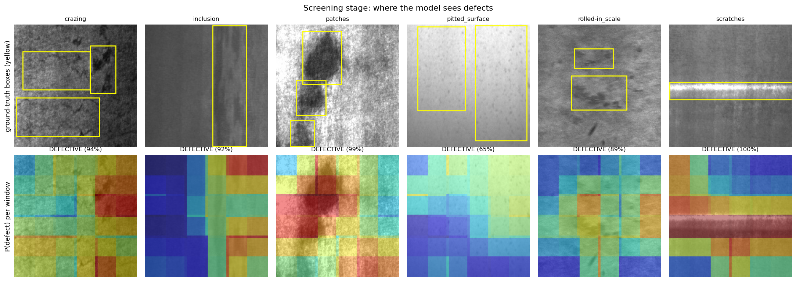

*Figure 17. Top: ground-truth boxes (yellow) on one test image per defect type. Bottom: the P(defect) of the 25 windows painted back onto the image, with the module's decision.*

The hot windows sit on the boxed defect for scratches and patches. For crazing and pitted surface the scores are spread over much of the image (pitted surface is rejected with only 65% confidence), which matches the weak window-level separation in Section 8.3.

### 10.2 End-to-end results on the test set

| Measure | Result |
|---|---|
| Defective test images rejected (threshold 0.5) | 270 of 270 (100.00%); 0 accepted by mistake |
| Detection rate by defect type | 100% for each of the 6 types |
| Defect type correct among the rejected | 92.96% |
| Normal test windows accepted (threshold 0.5) | 75.46% (289 of 383) |
| Decision time | 50.9 ms per 200x200 image (25 windows + defect type), about 19.6 images per second on the Colab runtime |
| Model size | 10.35 MB (Track A SVM) + 1.89 MB (Track B SVM) |

| Threshold on P(defect) | Defective test images rejected (%) | Normal test windows rejected (%) |
| :--- | ---: | ---: |
| 0.1 | 100.00 | 75.72 |
| 0.3 | 100.00 | 47.52 |
| 0.5 | 100.00 | 24.54 |
| 0.7 | 97.78 | 10.70 |
| 0.9 | 78.15 | 1.31 |

*Table 12. Threshold effect. Image rejection is measured on the 270 defective test images; false rejection on the 383 Normal test windows.*

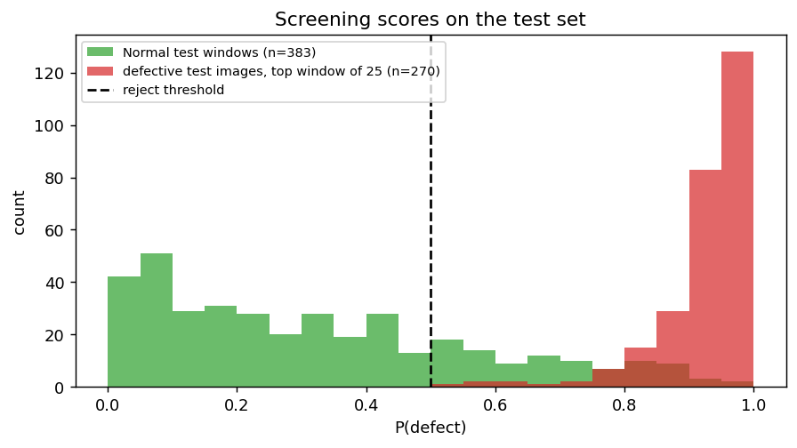

*Figure 18. P(defect) of the 383 Normal test windows (green) and of the most suspicious of 25 windows for each of the 270 defective test images (red). The dashed line is the 0.5 threshold. The two groups are not like for like: one is single windows, the other is a maximum over 25 windows.*

The top-window scores of the defective images pile up near 1.0, while the Normal windows are spread across the whole range, with a visible tail above the 0.5 line (the 24.54% false rejects).

### 10.3 What these numbers do and do not show

- **The 100% detection rate is not a quality-control result.** Every test image is defective, so only sensitivity is measured. The module rejects an image if any of its 25 windows crosses the threshold, and a single Normal window is falsely rejected 24.54% of the time. If window errors were independent, a Normal 200x200 image would be rejected with probability 1 - (1 - 0.2454)^25 = 99.9%. Overlapping windows are correlated, so the real rate would be lower, but it is almost certainly high. This is an illustration, not a measurement: the dataset contains no complete Normal image, so the false-reject rate on real Normal strips is unknown.
- **The threshold is a business decision.** At 0.9 the module still rejects 78.15% of defective test images (211 of 270, so 59 are accepted by mistake) and falsely rejects 1.31% of Normal windows; at 0.1 it rejects every defective image and 75.72% of Normal windows. The right value depends on the cost of a missed defect against the cost of scrapping good steel, and it has to be set on real Normal data.
- **Low-confidence decisions need a review path.** Accepted windows came with 56.9% to 74.3% confidence. A manual-review band for decisions below a chosen confidence is a sensible design; its limits were not tuned here.

### 10.4 Imaging conditions the models need

From Section 9, an installation using these models should keep the camera in focus (blur sigma 1 already costs 8.15 points on Track A and sigma 2 collapses it), keep sensor noise low (sigma 5 costs 12.96 points), keep strips within about 15 degrees of the training orientation, and keep exposure close to that of the training images (a gain of x0.75 cost 0.37 points, x1.25 cost 8.15). Training with blur, noise and rotation augmentation would be the first change to test; it was not done here.

### 10.5 Footprint

Both models together are 12.24 MB, and one decision takes 50.9 ms on a CPU, so the pipeline needs no GPU. The speed figure is hardware-specific and includes the HOG extraction for 25 windows.

## 11. Limitations

1. **No real Normal images.** Normal windows are box-free regions of defective strips. Boxes can miss faint defect texture, so "box-free" is not "defect-free" (in Figure 3, the Normal window on the crazing image has a dark mottled texture similar to the neighbouring boxed area). Normal windows also come from an uneven mix of source classes (Table 1: 699 from scratches, 67 from pitted surface), so the classifier may partly learn background cues of the source class. The Track B scores (78.11%) are therefore not an estimate of production accuracy, and the direction of the bias is unknown.
2. **Unknown false-reject rate on complete Normal images.** See Section 10.3. The module's 100% detection rate comes from images that are all defective.
3. **Annotation noise.** 22 file-name / XML disagreements and 123 images with more than one defect type (Section 3.2) put a ceiling on how cleanly the six classes can be separated.
4. **Small test sets.** 270 images (45 per class) means one image is 0.37 points. A 95% normal-approximation interval around 92.96% is about +/-3.05 points for Track A, and +/-2.77 for Track B at 78.11% (with correlated windows, so wider in practice). Differences of about one point between classifiers, such as the random forest and the RBF SVM on Track B, are not distinguishable.
5. **One split, one run.** Cross-validation is used inside the development set, but there is a single train / test split (seed 42) and a single run.
6. **Tuning limits.** Logistic regression was tuned on one CV fold, the random forest was not tuned, and five of the eight tuned settings sit at the edge of their grids (Table 6). The parsimony rule chose 6 bins for Track B although 12 bins scored 0.43 points higher in cross-validation.
7. **Synthetic degradations.** Brightness, noise, rotation and blur were applied to images that were already captured. They are not real camera variation, and no model was trained with augmentation.
8. **Two decision rules for Track B.** The classifier tables use each model's own decision rule; the module uses calibrated P(defect) >= 0.5 (Section 8.3). The two give slightly different detection rates.
9. **No comparison with other descriptors or deep models.** The lab studies HOG with classical classifiers only.

## 12. Conclusion

HOG features with an RBF SVM identify the defect type of a NEU-DET image reliably (92.96% test accuracy, 92.89% macro-F1) but separate Normal from Defective 64x64 windows much less well (78.11% accuracy, AUC 87.13%), so window screening is the limiting stage of the two-stage decision module. Cell size had a larger effect than the number of orientation bins (Track A mean macro-F1 of 82.08%, 88.52% and 91.26% for 4, 8 and 16 pixel cells), and the models are fragile: noise sigma 10 and blur sigma 2 cost 39.90 and 67.13 macro-F1 points on Track A. The module rejected all 270 defective test images, but because no complete Normal image exists in the dataset, its false-reject rate on real strips is unknown and probably high. The most useful next step is to replace the box-free Normal windows with real defect-free strips, which would give a measurable false-reject rate, and to retrain with blur and noise augmentation.

---

## Bonus: Real-Time Inspection Interface

The two SVM models saved by the notebook (`models/`) drive a real-time prototype in [`interface/`](interface/). For every video frame it crops a square region of interest, converts it to grayscale, scans 25 windows with the Track B model, names the defect type with the Track A model, and shows **PASS** or **DEFECTIVE** with the confidence and a per-window heat overlay. A web interface (upload an image, use the webcam, or process a video file) and a command-line tool use the same inspection code.

Quick start, from the `lab 5` folder:

```bash
python -m venv .venv
source .venv/bin/activate            # Windows: .venv\Scripts\activate
pip install -r interface/requirements.txt

python interface/realtime.py --source 0                   # webcam, OpenCV window
python interface/realtime.py --source demo/conveyor_demo.mp4   # video file
python interface/app.py                                   # web interface at http://127.0.0.1:7860
python interface/inspect_cli.py path/to/image.png         # prints PRODUCT INSPECTION RESULT
python interface/tools/make_demo_assets.py                # builds the demo video and sample images (needs internet)
pytest interface/tests -q                                 # parity tests against the notebook's results
```

The prototype shows the mechanics (HOG on every frame, two-stage decision, live overlay). It is **not** a validated production system: the models were trained on NEU images only, so a webcam pointed at other scenes gives meaningless decisions, and the robustness limits in Section 9 apply (focus, noise, orientation, exposure). Usage details, measured frame rates and screenshots are in [`interface/README.md`](interface/README.md).

---

## Appendix A: Lab Task Coverage

| Brief task | Where | Evidence |
|---|---|---|
| 1. Load and inspect the dataset | Section 3 | Tables 1 and 2, Figures 1 to 4 |
| 2. Resize to a common resolution | Section 4 | Figure 5 |
| 3. Convert to grayscale | Section 4 | Figure 5 |
| 4. Extract HOG features | Section 5 | Table 3 |
| 5. Visualise HOG | Section 5 | Figures 6 and 7 |
| 6. Train an SVM on HOG | Sections 6 and 8 | Tables 6 to 8 |
| 7. At least one more classifier | Section 8 | linear SVM, random forest, k-NN, logistic regression |
| 8. Compare the classifiers | Section 8 | Tables 7 and 8, Figure 9 |
| 9. Confusion matrix and classification report | Section 8 | Figures 10 and 12, reports |
| 10. Accuracy, precision, recall, F1 | Section 8 | Tables 7 and 8 |
| 11. Effect of cell size and orientations | Section 8.1 | cell sizes 4, 8, 16 x orientations 6, 9, 12, Figure 8 |
| 12. Robustness (brightness, noise, rotation, blur) | Section 9 | 4 conditions x 4 severities, change in accuracy and F1 |
| 13. Quality-control decision module | Section 10 | `PRODUCT INSPECTION RESULT` outputs |
| Bonus: real-time prototype | Bonus section | `interface/` |

## Appendix B: Repository Contents

```
lab 5/
├── README.md
├── NEU_SteelDefect_Lab05_HOG_Inspection.ipynb    executed notebook (outputs included)
├── assets/                                       figures used in this README
├── models/
│   ├── 6class__svm_rbf.joblib                    Track A SVM (10.35 MB)
│   ├── binary__svm_rbf.joblib                    Track B SVM (1.89 MB)
│   └── inspection_config.json                    HOG settings, window size, threshold, library versions
├── results/
│   ├── sweep_results.csv                         HOG parameter study
│   ├── tuning_results.csv                        classifier tuning
│   ├── comparison_results.csv                    test-set comparison
│   ├── robustness_results.csv                    robustness study
│   ├── results_summary.json
│   └── extras.json                               split, predictions, calibrated scores
└── interface/                                    real-time prototype (see Bonus)
```

## Appendix C: How to Reproduce

1. Open the notebook in Google Colab. Any runtime works; nothing uses the GPU.
2. Run all cells and allow the Google Drive prompt. The dataset is downloaded with `kagglehub.dataset_download("sovitrath/neu-steel-surface-defect-detect-trainvalid-split")`.
3. Results, models and figures are saved to `MyDrive/Lab05_NEU_HOG/run_<id>/`, where `<id>` is a hash of the notebook's CONFIG (`37c9b548` for this run).
4. If Colab disconnects, reconnect and run all cells again. Finished steps are loaded from Drive and skipped.

All random choices use seed 42.

## Appendix D: References

1. Dalal, N. and Triggs, B. (2005). Histograms of oriented gradients for human detection. *IEEE Conference on Computer Vision and Pattern Recognition (CVPR)*, 1, 886-893.
2. Song, K. and Yan, Y. (2013). A noise robust method based on completed local binary patterns for hot-rolled steel strip surface defects. *Applied Surface Science*, 285, 858-864. (Origin of the NEU surface defect database.)
3. Rath, S. R. (2023). Steel Surface Defect Detection using Object Detection. DebuggerCafe, https://debuggercafe.com/steel-surface-defect-detection/ (describes the train / validation repackage of NEU-DET used here).
4. Pedregosa, F. et al. (2011). Scikit-learn: machine learning in Python. *Journal of Machine Learning Research*, 12, 2825-2830.
5. scikit-image documentation, `skimage.feature.hog`.
