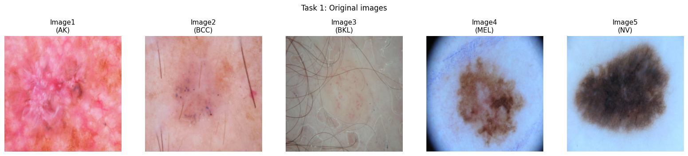
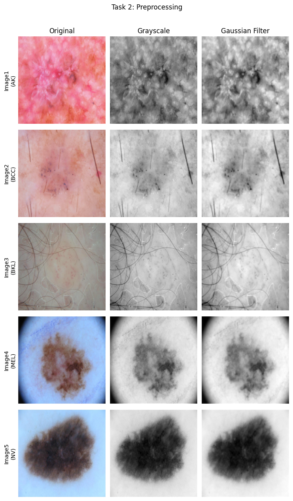
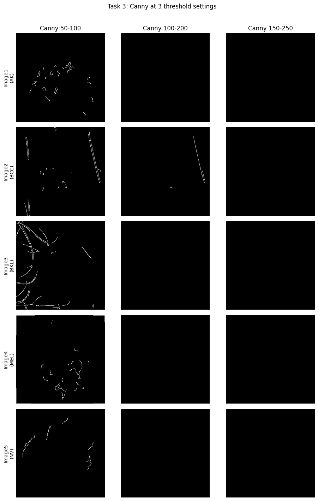
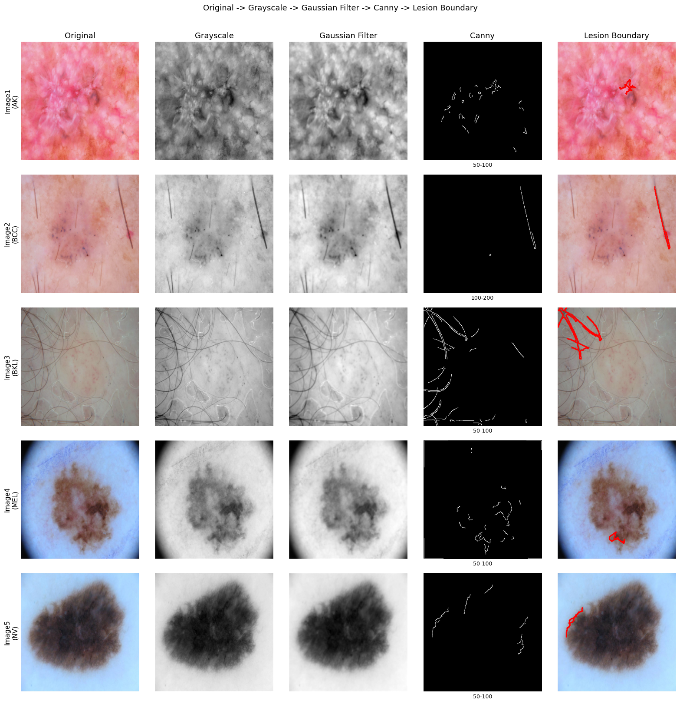
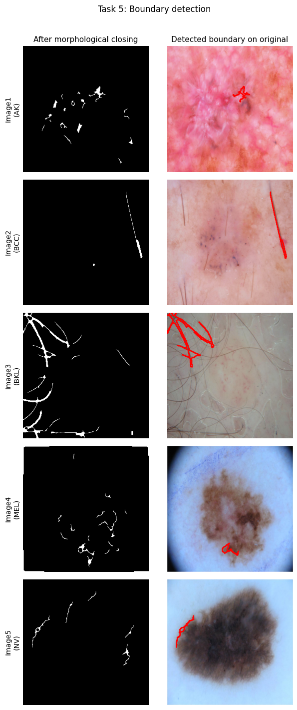
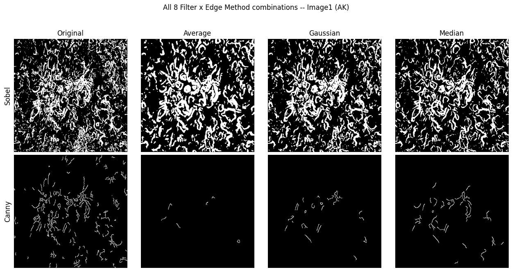

# Skin Lesion Boundary Detection Using Canny Edge Detection

**Author:** Adeel Asghar
**Notebook:** `ISIC2019_SkinLesion_BoundaryDetection.ipynb`

## 1. Problem Statement

Develop a simple computer vision system that detects the boundary of a skin lesion from a skin image using image filtering and Canny edge detection, and determine how effectively edge detection can separate the lesion from the surrounding skin.

## 2. Methodology

Five representative lesion images were used (one per class: AK, BCC, BKL, MEL, NV), drawn from the same ISIC 2019 subset used in the earlier labs in this series. Each image was resized to 320x320 and run through the full six-task pipeline:

1. **Load the image** (Task 1).
2. **Preprocess**: convert to grayscale, then apply a 5x5 Gaussian filter to reduce noise (Task 2).
3. **Canny edge detection** at three threshold settings: 50-100, 100-200, 150-250 (Task 3).
4. **Select the best threshold** per image using a real computed score rather than a visual judgement call: a density-plus-continuity quality score that peaks when the edge map has a plausible amount of edge content (close to 8% of pixels) arranged into a few long, connected strands rather than scattered fragments (Task 4).
5. **Detect the boundary**: morphological closing (a 7x7 elliptical kernel, to bridge the small gaps Canny typically leaves along a real lesion edge) followed by extracting the largest external contour, drawn on the original image (Task 5).
6. **Calculate lesion area and perimeter**: the contour is filled on a blank mask and the filled pixels are counted directly (the literal reading of "number of pixels inside the boundary"), and perimeter is the contour's arc length (Task 6).

Beyond the guided Task 1-6 walkthrough (which uses Gaussian preprocessing and Canny only), a second, broader sweep scores all 4 preprocessing filters (Original/no filter, Average, Gaussian, Median) against both edge-detection methods the Final Comparison table asks for (Sobel, Canny), for a total of 8 combinations per image, 40 (image, filter, edge method) combinations overall. The Results table reports each image's single best-scoring combination from that sweep; the Final Comparison table reports all 8 combinations' scores averaged across the 5 images. Canny rows in this broader sweep reuse each image's own best threshold from Task 4, so the two tables are two views of one consistent pipeline.

Since the brief leaves the Final Comparison table's four score columns undefined, each was computed directly rather than judged by eye, on a 0-10 scale:

- **Edge Quality**: the same density-plus-continuity score used for Task 4's threshold selection.
- **Noise Handling**: Dice similarity between the edge map from the clean image and from the same image with Gaussian noise added (sigma=25), using the same filter and edge method on both; higher means more robust to noise.
- **Boundary Detection**: contour solidity (contour area divided by convex-hull area) of the extracted boundary; close to 1 for a single, well-formed, roughly convex contour, 0 if no valid contour is found.
- **Overall Performance**: the plain mean of the three scores above.

## 3. Experimental Setup

- **Dataset**: ISIC 2019 (same source as the earlier labs in this series), filtered to the same 5 classes used throughout: MEL, NV, BCC, BKL, AK. 24,211 of 25,331 images matched one of these 5 classes.
- **Images used**: one representative image per class, 320x320 pixels after resizing.

| Image | Class |
|---|---|
| Image 1 | AK |
| Image 2 | BCC |
| Image 3 | BKL |
| Image 4 | MEL |
| Image 5 | NV |

- **Gaussian filter kernel**: 5x5 (Task 2 and the Gaussian row of the broader sweep).
- **Morphological closing kernel**: 7x7 elliptical (Task 5 and throughout the broader sweep).
- **Noise level for Noise Handling**: Gaussian noise, sigma = 25 (0-255 scale).
- **Environment**: pure OpenCV/NumPy, no GPU or training involved, executed in Google Colab.

## 4. Results

### 4.1 Tasks 1 to 3: Loaded Images, Preprocessing, and the Canny Threshold Sweep

Already visible here: Image 2 (BCC) and Image 3 (BKL) both have prominent hair strands crossing the frame, and Image 5 (NV) is a dense, fuzzy mole. That matters later (Question 5).

The 100-200 and 150-250 columns above are blank, or almost blank, for every image. That is the real result behind the Task 4 scores below, not an artifact of the table.

### 4.2 Task 4: Threshold Scores

| Image | Threshold | Quality Score | Edge Density (%) | Connected Components |
|---|---|---|---|---|
| Image 1 (AK) | 50-100 | **7.50** | 0.59 | 29 |
| Image 1 (AK) | 100-200 | 0.00 | 0.00 | 0 |
| Image 1 (AK) | 150-250 | 0.00 | 0.00 | 0 |
| Image 2 (BCC) | 50-100 | 13.75 | 0.86 | 17 |
| Image 2 (BCC) | 100-200 | **13.94** | 0.23 | 2 |
| Image 2 (BCC) | 150-250 | 0.00 | 0.00 | 0 |
| Image 3 (BKL) | 50-100 | **23.64** | 1.91 | 25 |
| Image 3 (BKL) | 100-200 | 0.00 | 0.00 | 0 |
| Image 3 (BKL) | 150-250 | 0.00 | 0.00 | 0 |
| Image 4 (MEL) | 50-100 | **12.59** | 0.92 | 23 |
| Image 4 (MEL) | 100-200 | 0.00 | 0.00 | 0 |
| Image 4 (MEL) | 150-250 | 0.00 | 0.00 | 0 |
| Image 5 (NV) | 50-100 | **8.97** | 0.38 | 12 |
| Image 5 (NV) | 100-200 | 0.00 | 0.00 | 0 |
| Image 5 (NV) | 150-250 | 0.00 | 0.00 | 0 |

(Winning threshold per image in bold.) Task 6's area/perimeter figures below come from each image's winning threshold here.

### 4.3 Required Visualization

This is the brief's required capstone figure (Original to Grayscale to Gaussian Filter to Canny to Lesion Boundary). Look closely at the rightmost column: the red overlay is not always on the lesion. Question 5 below discusses this directly, since it is the single most important finding in this assignment and the tables alone do not show it.

### 4.4 Task 5 and 6: Boundary Detection, Area, and Perimeter

| Image | Best Threshold | Lesion Area (pixels) | Lesion Perimeter (pixels) |
|---|---|---|---|
| Image 1 (AK) | 50-100 | 302 | 200.3 |
| Image 2 (BCC) | 100-200 | 367 | 374.6 |
| Image 3 (BKL) | 50-100 | 1,867 | 948.2 |
| Image 4 (MEL) | 50-100 | 324 | 158.1 |
| Image 5 (NV) | 50-100 | 248 | 219.5 |

Read together with the figure above, not in isolation: for Image 2 and Image 3, the contour being measured here is a hair strand (Image 2) or a cluster of hair strands (Image 3), not the lesion, so those area/perimeter numbers describe hair, not lesion size. Image 3's comparatively large area (1,867 pixels, the biggest of the 5) is a symptom of this, more hair was enclosed, not a better detection. Image 1, Image 4, and Image 5's contours are small fragments on or near the lesion rather than its actual outline. See Question 5.

### 4.5 Results Table (best filter and edge method per image, from the broader 8-way sweep)

| Image | Best Filter | Edge Method | Area (pixels) | Perimeter (pixels) |
|---|---|---|---|---|
| Image 1 | Average | Sobel | 34,168 | 4005.3 |
| Image 2 | Average | Sobel | 2,036 | 424.8 |
| Image 3 | Median | Sobel | 7,263 | 1017.5 |
| Image 4 | Gaussian | Sobel | 30,374 | 1392.3 |
| Image 5 | Average | Sobel | 50,957 | 1007.8 |

Sobel won for every image when all 8 combinations were scored on Overall Performance, never Canny. The figure above shows why this needs a caveat rather than being taken at face value: Sobel's output (top row) is a dense mass covering roughly half the frame, not a thin boundary, which is also why Sobel's areas here (up to 50,957 out of 320x320 = 102,400 pixels for Image 5) are far larger than the Canny-based areas in 4.4. Otsu thresholding on the Sobel gradient is picking up broad skin texture, not a lesion outline.

### 4.6 Final Comparison Table

| Method | Noise Handling | Edge Quality | Boundary Detection | Overall Performance |
|---|---|---|---|---|
| Original + Sobel | 2.61 | 0.79 | 6.03 | 3.14 |
| Original + Canny | 0.81 | 2.90 | 3.56 | 2.42 |
| Average + Sobel | 4.47 | 0.91 | 6.19 | **3.86** |
| Average + Canny | 2.66 | 0.61 | 3.77 | 2.34 |
| Gaussian + Sobel | 3.66 | 0.77 | 6.65 | 3.70 |
| Gaussian + Canny | 1.15 | 1.33 | 2.31 | 1.60 |
| Median + Sobel | 3.20 | 1.28 | 5.88 | 3.45 |
| Median + Canny | 1.52 | 1.48 | 2.59 | 1.87 |

(All scores on a 0-10 scale, averaged across the 5 images; best Overall Performance in bold.) Averaged across all 5 images, the 4 Sobel rows scored 3.54/10 on Overall Performance versus 2.06/10 for the 4 Canny rows. Best overall: Average + Sobel (3.86/10). Worst overall: Gaussian + Canny (1.60/10).

## 5. Discussion: Questions to Answer

**1. Why is Gaussian filtering applied before Canny detection?**

Canny's edge response is built on a Sobel-style gradient, which reacts to any sharp pixel-to-pixel intensity change, including the kind that pixel-level sensor noise and fine skin texture produce, not just the lesion boundary itself. Smoothing with a Gaussian filter first suppresses that high-frequency noise so the gradient step responds mainly to the larger, genuine intensity transition at the lesion edge rather than a flood of small, spurious ones. That this matters in practice shows up directly in Task 4: even after Gaussian smoothing, the one threshold setting that worked (50-100) still had to resolve 12 to 29 separate connected components per image before Task 5's morphological closing could merge them, so a meaningful amount of fragmentation survives the blur. The comparison table also shows a real limit to this benefit: Original + Canny (no blur at all, beyond the mandatory grayscale conversion) had the single highest Edge Quality score in the entire table (2.90), clearly ahead of Gaussian + Canny (1.33). With this notebook's fixed, non-adaptive threshold pairs, a stronger blur also suppresses some of the genuine boundary gradient, not just noise, so "more blur" did not simply mean "cleaner edges" here. The real value of the Gaussian step and its real limitation (shown by the data) are two sides of the same mechanism: it trades off gradient strength against noise suppression, and the trade only pays off when the threshold is matched to how much blur was applied.

**2. How did the three Canny threshold settings affect the result?**

The effect was close to binary rather than a smooth trade-off, visible directly in the Task 3 figure above. At 50-100, every one of the 5 images produced a real, non-empty edge map (quality scores from 7.50 to 23.64, edge density 0.38% to 1.91%, 12 to 29 connected components). At 100-200, 4 of the 5 images produced a completely empty edge map (quality score 0.00, 0 connected components), and only Image 2 (BCC) still found anything, a much sparser result than its own 50-100 pass (density dropped from 0.86% to 0.23%). At 150-250, all 5 images, including Image 2, produced a completely empty edge map. So raising the thresholds did not gradually clean up the boundary the way a textbook illustration often shows; past a fairly low point, it erased the boundary outright. Canny only seeds an edge where the gradient magnitude clears the upper threshold, so this pattern pins down roughly where these boundaries' peak gradient strength actually sits after a 5x5 Gaussian blur on a 320x320 image: high enough to clear 50-100's upper cutoff of 100 (every image produced edges there), but not high enough to clear 100-200's upper cutoff of 200 for 4 of the 5 images. Image 2 (BCC) was the one exception, with a strong enough boundary to clear 200 but not 150-250's cutoff of 250.

**3. Which threshold produced the best lesion boundary?**

50-100, for every image, but only in the narrow sense that it was the sole setting to produce a non-empty edge map for 4 of the 5 images, and was statistically indistinguishable from the only other non-empty option for the fifth (Image 2: 13.75 at 50-100 versus 13.94 at 100-200). This should not be read as "50-100 produced a good lesion boundary" in an absolute sense. As Question 5 and the figures in Section 4 show, even this winning threshold's resulting contour traces a hair strand rather than the lesion for Image 2 and Image 3, and only a small fragment of the true lesion for the other three. "Best" here means best among the three options actually tested, not a reliable lesion boundary on its own.

**4. Why are edges useful for detecting skin lesions?**

A lesion is visually distinct from surrounding skin mainly through a change in color and intensity at its border, which is exactly what an edge detector is built to find: a location where image intensity changes sharply. Tracing that boundary gives a direct, interpretable geometric outline of the lesion (what Task 5's drawn contour and Task 6's area/perimeter numbers are built from) without needing any labeled training data or a trained classifier, unlike the CNN-based classification approach used earlier in this lab series. That also makes it cheap: every result in this notebook came from simple gradient and morphology operations that ran in a fraction of a second per image, no GPU involved. This run is also a useful counter-example (Question 5): edges mark *any* sharp intensity change, not specifically lesion ones, so the same property that makes edges cheap and useful also makes them easy to fool with hair or texture.

**5. What problems did you observe in detecting the lesion boundary?**

Several, all visible directly in the figures and numbers above, not hypothetical:

- **The detected "boundary" was often not the lesion at all.** This is the headline result of this run, and it only shows up by looking at the actual images, not the area/perimeter table alone. For Image 2 (BCC) and Image 3 (BKL), the extracted contour clearly traces a hair strand (Image 2) or a tangle of several hair strands (Image 3) rather than the lesion, visible directly in the Required Visualization and Task 5 figures in Section 4. Those were simply the largest closed shapes left after morphological closing; the method has no way to distinguish "hair" from "lesion," it only measures size and closure. For Image 1 (AK), Image 4 (MEL), and Image 5 (NV), the contour is a small fragment on or beside the lesion rather than tracing its actual visible extent. Out of 5 images, none produced a contour that cleanly traces the real lesion boundary.
- **Threshold fragility.** Moving from 50-100 to 100-200 did not just reduce edge count, it eliminated the edge map entirely for 4 of 5 images, and 150-250 eliminated it for all 5 (Section 4.1, 4.2). A detector that fails completely rather than degrading gracefully is a real weakness for an automated pipeline with no human in the loop to notice.
- **Fragmentation even at the working threshold.** Even the winning 50-100 setting left 12 to 29 disconnected edge components per image before morphological closing (Section 4.2), meaning raw Canny output was far from a single clean boundary curve. How well closing bridged those gaps varied a lot, and sometimes it bridged the wrong thing (hair strands into a closed loop, as above) rather than the true lesion edge. Task 6's resulting perimeters ranged from 158.1 to 948.2 pixels and areas from 248 to 1,867 pixels across 5 similarly-sized images (Section 4.4), an almost 8-fold spread that reflects how inconsistent this step was per image, not a real 8-fold difference in lesion size.
- **Oversegmentation from Sobel.** The Results table's automatically-selected "best" combination was Sobel for all 5 images, with areas from 2,036 up to 50,957 pixels (Section 4.5), the latter roughly half of the entire 320x320 frame, visible directly in the sweep figure as a dense mass rather than a thin boundary. That is Sobel's gradient magnitude, thresholded with Otsu rather than a fixed cutoff, picking up broad skin texture and background gradient as "edge," which morphological closing then merges into one large, technically well-formed (high-solidity) blob. A scoring rule built only from solidity, noise robustness, and edge density cannot by itself tell a correctly-sized boundary from an oversized one that happens to still look convex, or a hair-shaped one from a lesion-shaped one.
- **A threshold tuned for one filter did not transfer cleanly to another.** The broader sweep reused each image's Task 4 threshold across all 4 filters when paired with Canny. That mismatch shows up most clearly for Average + Canny, which had the lowest Edge Quality of any Canny row (0.61) and a near-vanishing boundary for every one of the 5 images (areas of 52, 0, 245, 107, and 56 pixels, versus thousands of pixels for most other combinations), including one outright failure (Image 2: Area = 0, Perimeter = 0.0, no contour found at all), because that threshold was never actually tuned for the Average-filtered version of the image.

**6. How could your method be improved?**

- **Remove hair and texture artifacts before edge detection.** This is the most direct fix for this run's biggest problem. Standard dermoscopy preprocessing, for example a black-hat morphological filter to isolate thin dark strands followed by inpainting over them (the common "DullRazor"-style approach), would stop hair from ever being eligible to become the "largest contour" in the first place, directly addressing the Image 2 and Image 3 failures.
- **Adaptive, not fixed, Canny thresholds.** Something like Otsu's method (already used for the Sobel comparison in this notebook) or the common median-based heuristic (low = 0.67 x median gradient, high = 1.33 x median gradient) would scale the threshold to each image's own gradient strength, directly addressing the all-or-nothing failure seen at 100-200 and 150-250.
- **Penalize implausible boundary size and shape, not just solidity.** Adding a size-plausibility term (for example, penalizing any contour above some fraction of total image area, or below a minimum area) and a shape prior (lesions are typically blob-like, hair strands are typically long and thin, so a width-to-length or elongation check would catch the Image 2/3 failures directly) would stop both the Sobel oversegmentation and the Canny hair-tracking from being automatically rewarded.
- **Refine the initial boundary with a region-based step.** Seeding an active-contour (snake) or GrabCut pass from the Canny or Sobel boundary found here could pull the contour toward the real lesion-to-skin color/intensity transition, correcting both Canny's tendency to vanish entirely at this dataset's typical gradient strength and Sobel's tendency to oversegment.

## 6. Conclusion

Across these 5 representative lesion images, a Gaussian-filtered, Canny-based boundary only worked reliably at the lowest of the brief's three example threshold settings (50-100); the higher two (100-200, 150-250) returned an empty edge map for nearly every image rather than a cleaner one. More importantly, even that working threshold did not reliably find the lesion: the Required Visualization and Task 5 figures show the extracted boundary tracking a hair strand instead of the lesion for 2 of the 5 images, and only a small fragment of the real lesion for the rest, a failure the area and perimeter numbers alone would not have revealed without looking at the actual images. The broader filter-by-edge-method sweep found Sobel with Otsu thresholding more consistently produced a closed, high-solidity contour than Canny did (3.54/10 versus 2.06/10 average Overall Performance), but at the cost of a much larger, less tightly-fitted boundary, up to roughly half the image frame in one case. Neither technique's "best" result, by its own score, was actually a correct, tightly-fitted lesion boundary, so the clearest next step is not just an adaptive threshold but a hair and texture removal preprocessing stage before any edge detector is applied at all.

